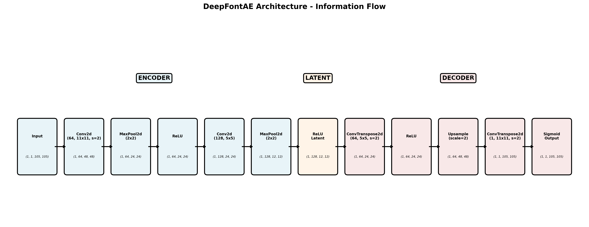
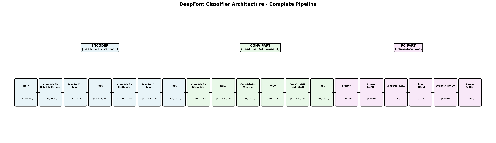
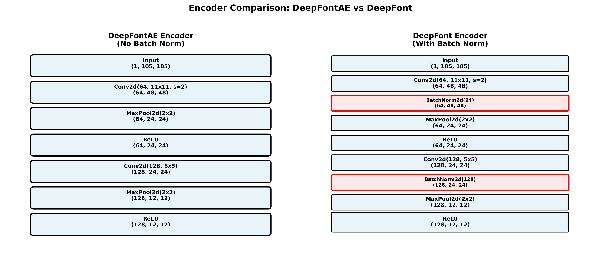

# DeepFont-Torch


A PyTorch implementation of DeepFont for font recognition.

## Overview

DeepFont is a deep learning approach for recognizing fonts from images. This project reimplements the DeepFont architecture using PyTorch.

## Features

- PyTorch implementation of the DeepFont architecture
- Font recognition from text images
- Pre-trained model support
- Training and inference pipelines

## Installation

```bash
# Clone the repository
git clone https://github.com/michaelriedl/deepfont-torch.git
cd deepfont-torch

# Install dependencies using uv
uv sync
```

## Requirements

- Python >= 3.12
- [uv](https://docs.astral.sh/uv/) - Fast Python package installer
- PyTorch
- Additional dependencies listed in `pyproject.toml`

## Usage

### Training

```python
# Example training code
```

### Inference

```python
# Example inference code
```

## Model Architecture

Here we make explicit the architecture of the DeepFont model as reimplemented in PyTorch. This is important as the original paper provides limited architectural details and requires interpretation of various figures and descriptions. Various other open-source implementations exist, but they often do not accurately reflect the original architecture.

This implementation includes two main models: **DeepFontAE** (autoencoder for unsupervised pretraining) and **DeepFont** (the full classification model). Detailed architecture visualizations are available in [notebooks/model_architectures_visualized.ipynb](notebooks/model_architectures_visualized.ipynb).

### DeepFontAE (Autoencoder)

The autoencoder is used for unsupervised pretraining on unlabeled font images. It learns to compress and reconstruct 105×105 grayscale images through an encoder-decoder architecture.



**Architecture:**
- **Input:** (1, 105, 105) grayscale images
- **Encoder:**
  - Conv2d(64 filters, 11×11 kernel, stride=2) → (64, 48, 48)
  - MaxPool2d(2×2) → (64, 24, 24)
  - ReLU activation
  - Conv2d(128 filters, 5×5 kernel) → (128, 24, 24)
  - MaxPool2d(2×2) → (128, 12, 12)
  - ReLU activation
- **Latent Representation:** (128, 12, 12) = 18,432 dimensions
- **Decoder:**
  - ConvTranspose2d(64 filters, 5×5 kernel, stride=2) → (64, 24, 24)
  - ReLU activation
  - Upsample(scale=2) → (64, 48, 48)
  - ConvTranspose2d(1 filter, 11×11 kernel, stride=2) → (1, 105, 105)
  - Sigmoid activation (optional)
- **Output:** (1, 105, 105) reconstructed image

The encoder learns low-level feature representations that can be transferred to the classification model.

### DeepFont (Classifier)

The full classification model extends the encoder with additional convolutional and fully connected layers for font recognition.



**Architecture:**
- **Input:** (1, 105, 105) grayscale images
- **Stage 1 - Encoder (Feature Extraction):**
  - Conv2d(64 filters, 11×11 kernel, stride=2) + BatchNorm2d → (64, 48, 48)
  - MaxPool2d(2×2) → (64, 24, 24)
  - ReLU activation
  - Conv2d(128 filters, 5×5 kernel) + BatchNorm2d → (128, 24, 24)
  - MaxPool2d(2×2) → (128, 12, 12)
  - ReLU activation
- **Stage 2 - Conv Part (Feature Refinement):**
  - Conv2d(256 filters, 3×3 kernel, padding='same') + BatchNorm2d → (256, 12, 12)
  - ReLU activation
  - Conv2d(256 filters, 3×3 kernel, padding='same') + BatchNorm2d → (256, 12, 12)
  - ReLU activation
  - Conv2d(256 filters, 3×3 kernel, padding='same') + BatchNorm2d → (256, 12, 12)
  - ReLU activation
- **Stage 3 - FC Part (Classification):**
  - Flatten → (36,864)
  - Linear(4096) + Dropout + ReLU → (4096)
  - Linear(4096) + Dropout + ReLU → (4096)
  - Linear(num_classes) → (num_classes)
- **Output:** Class logits for font prediction

### Key Differences: DeepFontAE vs DeepFont



The main architectural differences between the two models:

1. **Batch Normalization:** The classifier encoder includes BatchNorm2d layers after each Conv2d, while the autoencoder encoder does not. This improves training stability and convergence for the supervised classification task.

2. **Purpose:** The autoencoder is trained for reconstruction (unsupervised), while the classifier is trained for font recognition (supervised).

3. **Additional Layers:** The classifier extends the encoder with 3 additional convolutional layers (conv_part) and 3 fully connected layers (fc_part) for classification.

## Dataset

The original dataset can be found [here](https://www.dropbox.com/scl/fo/l7ip8qs7f7bcf3mom3vrh/AH1fN2bwEm072FBpjdyRzw4?rlkey=pq1doxi1kmoxqut6j00smxyh4&e=1&st=vzbptgqt&dl=0).

Information about the dataset used for training and evaluation.

## Results

Performance metrics and comparison with the original paper.

## Project Structure

```
deepfont-torch/
├── pyproject.toml       # Project dependencies
├── README.md            # This file
└── LICENSE              # License file
```

## Contributing

Contributions are welcome! Please feel free to submit a Pull Request.

## License

This project is licensed under the terms specified in the LICENSE file.

## Citation

If you use this implementation in your research, please cite:

```bibtex
@inproceedings{wang2015deepfont,
  title={Deepfont: Identify your font from an image},
  author={Wang, Zhangyang and Yang, Jianchao and Jin, Hailin and Shechtman, Eli and Agarwala, Aseem and Brandt, Jonathan and Huang, Thomas S},
  booktitle={Proceedings of the 23rd ACM international conference on Multimedia},
  pages={451--459},
  year={2015}
}

@software{riedl2025deepfont,
  title={DeepFont-Torch: A PyTorch Implementation of DeepFont},
  author={Riedl, Michael},
  year={2025},
  url={https://github.com/michaelriedl/deepfont-torch}
}
```

## References

- [Original DeepFont Paper](https://arxiv.org/abs/1507.03196)

## Acknowledgments

Based on the original DeepFont work by Wang et al.
